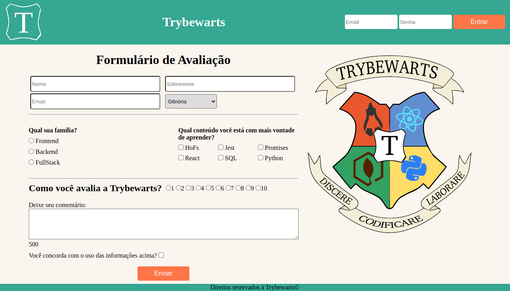

# Projeto Trybewarts

Projeto desenvolvido durante o curso da Trybe para fixação de aprendizados criando uma página contendo um formulário em que pessoas estudantes podem enviar feedbacks sobre a escola. O projeto foi baseado no tema Harry Potter em que tem a escola Hogwarts.

Foi praticado HTML, CSS e Javascript com a manipulação do DOM.

